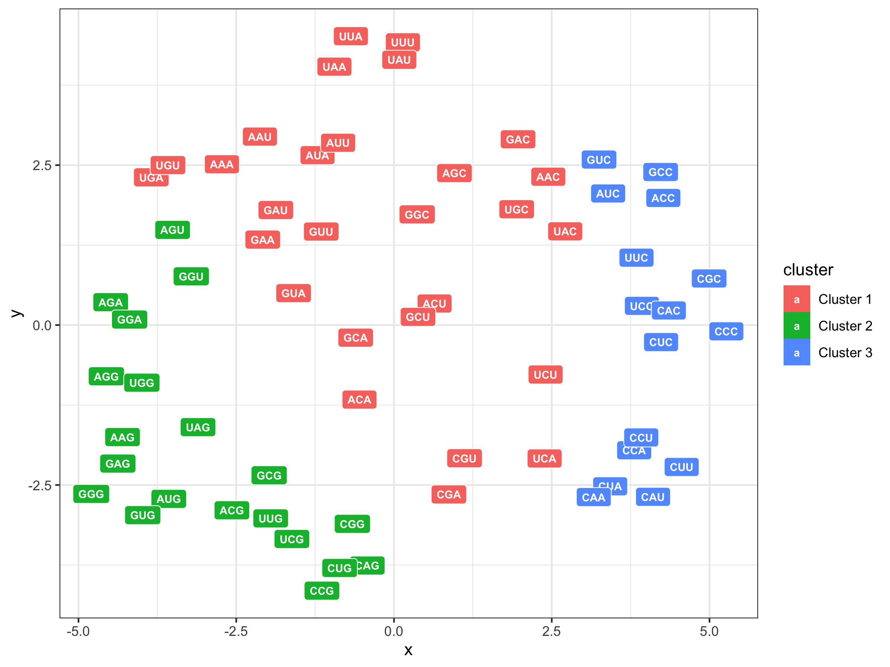
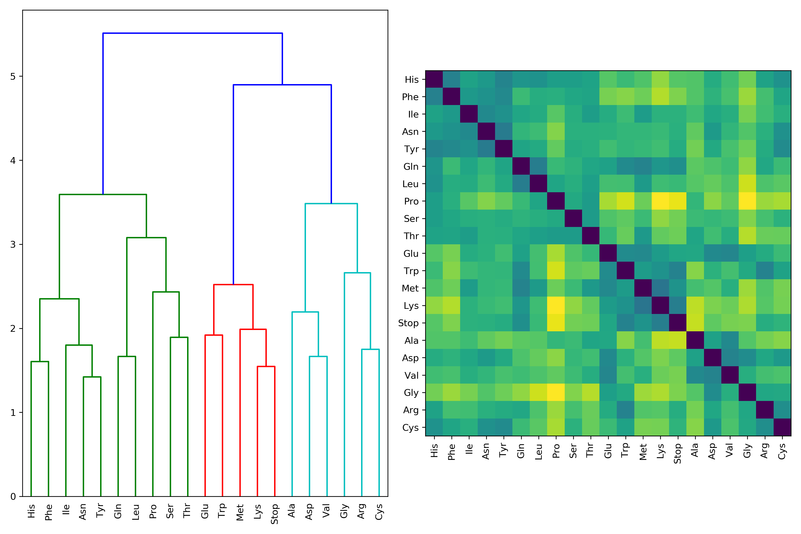

### Codon Graph

- Node: Codon
- Edge: Single base mutation
- Node attribution: Amino Acid
- Edge attribution: Mutation frequency $p(u,v)$ 
- Constructed by networkx

### Random walk

- Start from each **node** $u \in V$
- Run **fix-length** ($d$) walk based on **edge attribution** (Strategy $R$) $m$ times 
- Obtain **set of nodes** passed $N_R(u)$
- Loss function $L = \sum_{i=1}^m\sum_{u\in V}\sum_{v\in N_R(u)}-\log(\frac{\exp(z_u^Tz_v)}{\sum_{n\in V}\exp(z_u^Tz_n)})$

### Result

We have visulaized the codon embeddings and measure the mutation distance between amino acids.





If you want to obtain the similar result, you can run the following commands.

```shell
python main.py
Rscript pca.R
```

